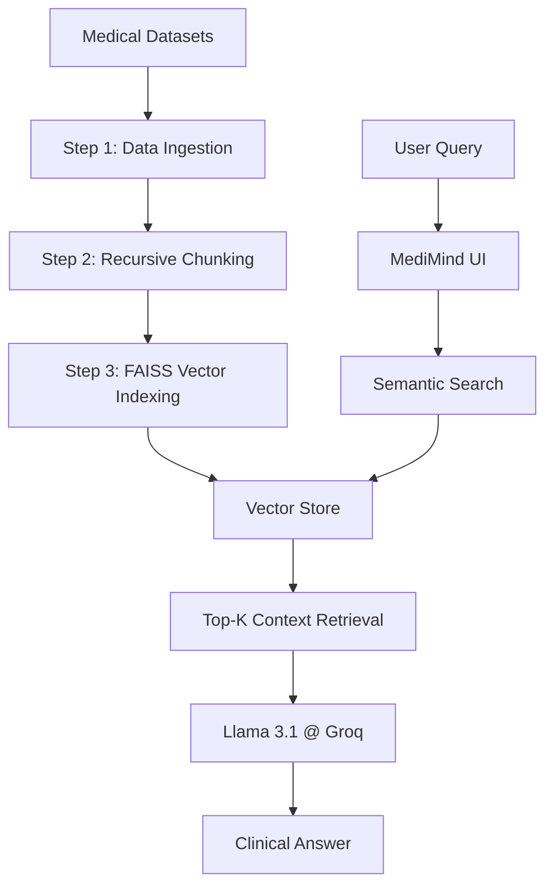

# ✨ MediMind AI: Professional Medical RAG System

[](https://www.python.org/)
[](https://langchain.com/)
[](https://groq.com/)
[](https://streamlit.io/)

A state-of-the-art **Retrieval-Augmented Generation (RAG)** system designed for high-precision medical knowledge retrieval. This project utilizes the **MedQuAD** and **ChatDoctor** datasets to provide clinically grounded information through a premium, glassmorphic user interface.

---

## 🌟 Features

- **🚀 High-Performance RAG**: Leveraging FAISS for lightning-fast vector search across 46,000+ medical records.
- **🧠 Advanced LLM Integration**: Powered by Llama 3.1 via Groq Cloud API for near-instant responses.
- **🎨 Premium UI/UX**: Custom Streamlit interface featuring glassmorphism, 3D cards, and smooth animations.
- **🔬 Clinical Grounding**: Strict prompt engineering ("Steel-Wall" protocol) to prevent hallucinations and ensure factual accuracy.
- **⚡ Cross-Platform**: Fully relative path management for seamless deployment on Windows, Mac, or Linux.

---

## 🏗️ Architecture



---

## 🛠️ Installation & Setup

### 1. Clone the repository
```bash
git clone https://github.com/yourusername/medimind-ai.git
cd medimind-ai
```

### 2. Install Dependencies
```bash
pip install -r requirements.txt
```

### 3. Configure Environment
Create a `.env` file in the root directory:
```env
GROQ_API_KEY=your_groq_api_key_here
```

### 4. Build the Pipeline
Run the steps sequentially to prepare the database:
```bash
python step1_load_data.py
python step2_chunking.py
python step3_embeddings.py
```

### 5. Launch the Application
```bash
streamlit run step5_app.py
```

---

## 🧪 Technical Stack

- **Orchestration**: LangChain
- **Embeddings**: HuggingFace (`all-MiniLM-L6-v2`)
- **Vector Database**: FAISS
- **LLM**: Meta Llama 3.1-8B (via Groq)
- **Frontend**: Streamlit with Custom CSS injection

---

## 📄 License
Distributed under the MIT License. See `LICENSE` for more information.

## 🤝 Contact
Your Name - [LinkedIn](https://linkedin.com/in/yourprofile) - email@example.com
